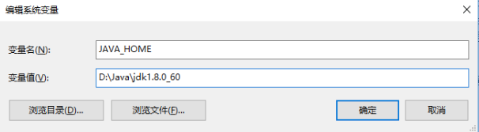
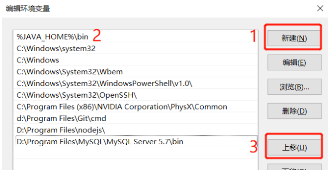
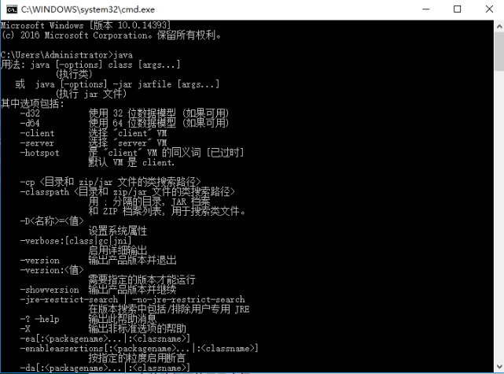

<LastUpdated />

## JDK下载

目前市面上使用较多的是jdk8，所以我们可以下载jdk8，也可以下载最新的长期支持版本进行学习。

- 下载方式一：

oracle官网下载JDK：http://www.oracle.com

- 下载方式二：

传送门：https://pan.baidu.com/s/1LsaI45c_QhVcRKIiNS14rQ?pwd=chsy 提取码: chsy

里面包含jdk8的各个系统版本安装包、以及当前最新的长期支持版本jdk17，学习够用了，若需要其他指定版本可以去官网下载。

## 配置环境变量

- Windows系统配置方式

配置路径：右键我的电脑—属性—右侧高级系统设置—环境变量

1、新建系统变量JAVA_HOME



2、在系统变量PATH中新增一行，填入bin目录（%JAVA_HOME%\bin）



- Linux系统配置方式

```vim ~/.bashrc``` or ```vim /etc/profile```
```
export JAVA_HOME=/home/chsy/java/jdk1.8.0_212
export PATH=$JAVA_HOME/bin:$PATH
```

## 环境验证

环境变量配置后，需要验证是否配置成功，打开命令提示符（如果之前有开启命令提示符，需要全部关闭重新再打开），快捷键win+r，输入cmd。

在命令提示符里面输入java和javac后若输出如图相关提示即为配置成功。



## JDK目录介绍

安装完JDK后，JDK的安装路径下会有一些文件夹

- bin目录：该目录用于存放一些可执行程序。
- include目录：由于JDK是通过C和C++实现的，因此在启动时需要引入一些C语言的头文件，该目录就是用于存放这些头文件的。
- lib目录：lib是library的缩写，里面存放了 Java 类库或库文件，是开发工具使用的归档包文件。
- src.zip文件：src.zip为src文件夹的压缩文件，src中放置的是JDK核心类的源代码，通过该文件可以查看Java基础类的源代码。